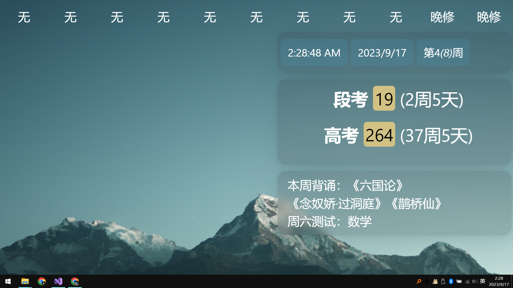
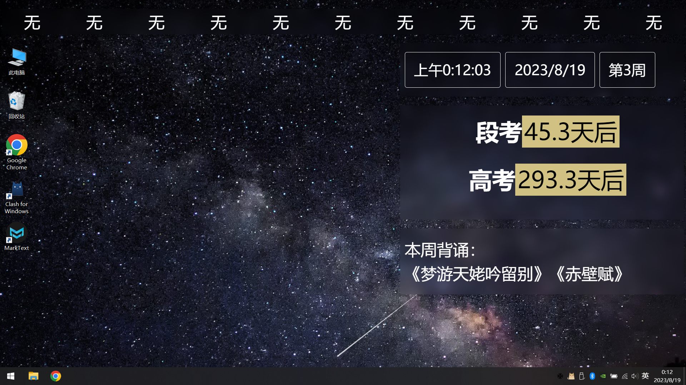
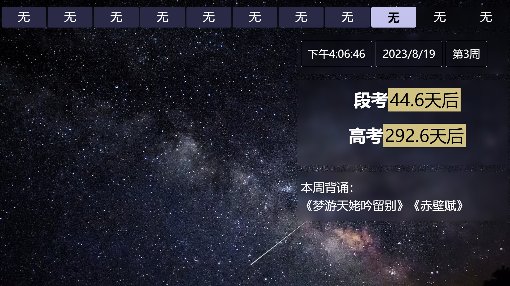

# 关于 ClassBoardSharp

 [](https://candlest.github.io/ClassBoard-F8/)

ClassBoardSharp 是 [ClassBoard](https://github.com/Candlest/ClassBoard) 的二代版本，是一款使用 CefSharp 开发的，针对SEEWO及其教学一体机设计的，用于显示教学信息的壁纸软件。

ClassBoardSharp相对 ClassBoard 一代的缺点：

- 软件**大**了（50MB → 225MB）；
- 占用**大**了（Win GDT → Chromium Blink）；
- 启动**慢**了（在希沃 H84 开机实测中：无感知地开机启动 → 需要3-5s才能将页面加载完毕）

ClassBoardSharp相对 ClassBoard 一代的优点，是采用 HTML/JS/CSS 构建页面：

- 页面可**几乎完全定制**
- 页面可**随时修改**
- 更**方便**、更**自由**地写出更好看的页面

## 运行演示

在浏览器中预览：https://candlest.github.io/ClassBoard-F8/

在Windows上的运行截图：




[ClassBoard-F8](https://github.com/Candlest/ClassBoard-F8)运行截图：


---

**README 目录**

- [关于 ClassBoardSharp](#关于-classboardsharp)
  - [运行演示](#运行演示)
  - [使用教程](#使用教程)
    - [获取程序](#获取程序)
    - [运行程序](#运行程序)
    - [添加程序到开机启动项](#添加程序到开机启动项)
      - [设置开机自启动](#设置开机自启动)
      - [关闭开机自启动](#关闭开机自启动)
    - [修改页面](#修改页面)
      - [添加课表、倒计日、布告栏内容](#添加课表倒计日布告栏内容)
      - [修改背景页面](#修改背景页面)
      - [遇到Bug的解决方案](#遇到bug的解决方案)
  - [附录](#附录)
    - [关闭冰点还原](#关闭冰点还原)
  - [相关 Efforts](#相关-efforts)
  - [贡献者](#贡献者)
  - [License](#license)

## 使用教程

项目结构：

```treeview
.
├── Background
├── README.html
├── events.txt
├── schedule.txt
├── board.txt
└── ClassBoard.exe
```

### 获取程序

从 GitHub 的 [Release 页面](https://github.com/Candlest/ClassBoardSharp/releases) 下载

### 运行程序

解压压缩包至文件夹。

双击运行程序`ClassBoard.exe`，即可加载`Background/main.html`为桌面背景。

### 添加程序到开机启动项

> ⚠️ 请确认一体机是否开启冰点还原功能，如有则请在<u>征得管理员同意下</u>关闭，才能添加启动项。
> 
> 关于冰点还原的关闭，参考[关闭冰点还原](#关闭冰点还原)一节。

#### 设置开机自启动

已集成至设置页面。

第一步： 按下“打开启动项文件夹“按钮，此时本程序快捷方式已经自动复制到剪切板中； 

第二步：在启动项文件夹中右键粘贴快捷方式至文件夹中；

#### 关闭开机自启动

第一步： 按下“打开启动项文件夹“按钮； 

第二步：在启动项文件夹中删除本程序的快捷方式；

打开任务管理器选择`启动`选项卡或者运行`msconfig`，可以看到我们刚刚添加的启动项。

### 修改页面

#### 添加课表、倒计日、布告栏内容

在托盘中点击`setting`按钮进入设置界面，或者手动修改下面的文件：

> 为尽量减少迁移成本，`class.js`和`event_cal.js`中`source`和`source_cal`与原先`kb.csv`和`djr.csv` ~~一致~~ 大致一致。
> （因为原来的行与行之间需要用**英语半角逗号 ‘,’**替代）
> 
> 同时注意，所有的逗号请使用英文半角符号的逗号，是 `,` 而不是`，` 

| 文件           | 备注                                                                                                                                    |
| ------------ | ------------------------------------------------------------------------------------------------------------------------------------- |
| schedule.txt | 第一行是表头，请勿修改。<br>目前。仅支持每天 1+5+3+2=11 节课，按照省实2024届的高三课表识别当前课程。<br>如果你有其他需求，暂时需要修改 Background/js/class.js 来实现，需要 javascript 和 HTML 相关基础。 |
| events.txt   | 第一行是表头，请勿修改。<br>请按照：“事件，日期” 的格式添加条目。<br>e.g. 高考, 2024-06-07                                                                           |
| board.txt    | 可以包含html标签，如\<strong>,\<ins>, \<del>等。<br>换行符请使用\<br/> 标签。<br>e.g:<br> 本周背诵：<br/>《梦游天姥吟留别》《赤壁赋》                                       |

修改以后，请在托盘中点击`restart`按钮重载应用。

#### 修改背景页面

修改背景图片以及其他样式，请至 Background/css/custom.css 。

#### 遇到Bug的解决方案

收集错误信息，在此项目下提出`issue`：[Candlest/ClassBoardSharp](https://github.com/Candlest/ClassBoardSharp/issues) 。

ClassBoardSharp 采用 C# .NET Framework 4.6.1 + CefSharp 编写，如遇错误请复制 .NET Framework 的报错信息。

Background/ 部分采用 HTML/JS/CSS 编写，由着前端能跑就行，从不`panic`的习惯，如果页面的渲染出现了一些奇奇怪怪的Bug，建议使用Chrome的开发者模式Debug 。

> ⚠ 由于读取课表、日历和布告栏采用 CefSharp 传参的方式，若要在 Chrome 运行则需要对 `Background/js/` 下文件进行修改

打开目录`Background/js/`：

```treeview
./Background/js
├── class.js
├── event_cal.js
├── help.js
└── main.js
```

| 文件           | 备注                 | 来源           |
| ------------ | ------------------ | ------------ |
| class.js     | 修改其中source变量内容     | schedule.txt |
| event_cal.js | 修改其中source_cal变量内容 | events.txt   |
| help.js      | 修改其中source_str变量内容 | board.txt    |

## 附录

### 关闭冰点还原

> ⚠️ 建议备份相关文件

要删除冰点还原，需要在PE环境（或者安全模式）下，删除以下文件：

- `C:\Program Files (x86)\Seewo\SeewoService\SeewoService_1.3.6.3254`里的`SeewoFreeze`
- `C:\ProgramData`里的文件夹`SeewoFreeze`， `SeewoFreezeConfig` 和 `SeewoFreezeKernelConfig`
- `C:\ProgramData\Seewo`里的`Freeze`

如果想恢复冰点，可以重新安装 Seewo 管家。

## 相关 Efforts

本项目是对前辈 ClassTool 的拙劣模仿。 ClassTool 使用 Electron + Vue.JS 构建。

> #### [ClassTool](https://github.com/IcariaWorks/ClassTools)
> 
> 一个用在班级电脑上面的动态壁纸系统，显示高考倒计时、作业、课程表、值日生等

非常感谢 CefSharp 提供平滑的 .NET + CEF 开发体验。

> #### [CefSharp](https://github.com/cefsharp/CefSharp)
> 
> .NET (WPF and Windows Forms) bindings for the Chromium Embedded Framework

## 贡献者

感谢参与测试、提供修改建议，参与代码修改的八班九班同学！

尤其是 [@Candlest](https://github.com/Candlest) 和 [@mike-unk](https://github.com/mike-unk) 以及 [@E7G](https://github.com/e7g) 同学！

欢迎任何的贡献！

## [](https://github.com/Candlest/ClassBoard#license)License

本项目使用 **MIT License** 开源。
